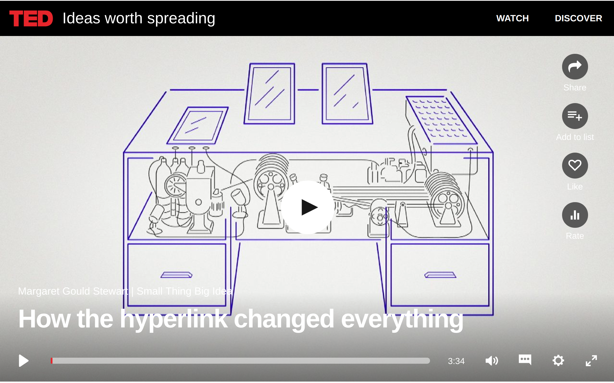
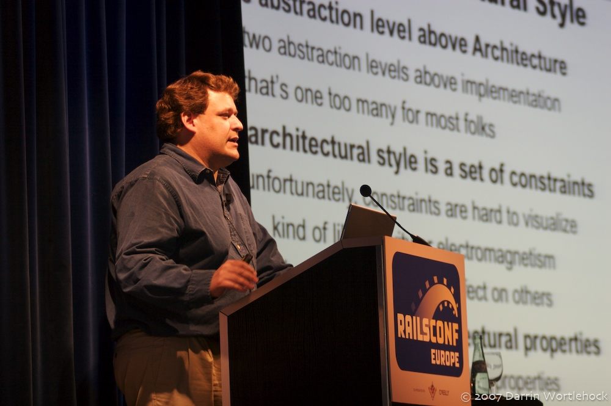
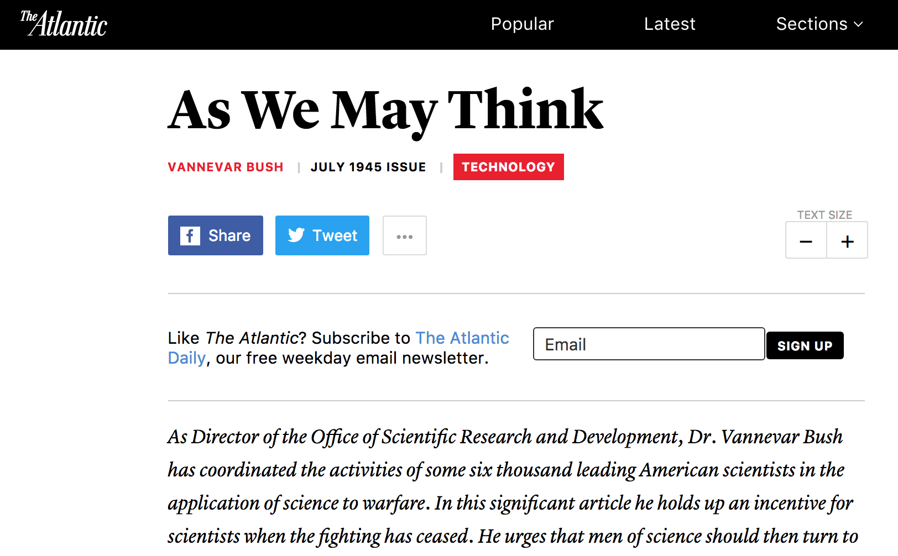
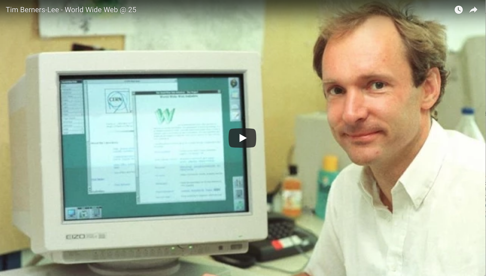

This presentation is published as an open educational resource. Collaborative improvement is welcome.

GitHub repository: https://github.com/heinzwittenbrink/slides-historyofhypermedia

---

Goal today: Understanding what we have to know about the technical aspects of content.

How does content technically support the design of connected services with many touchpoints?

---

Most important topics:

- Separation of content and presentation
- Links and addresses
- Metadata

---

---

{width=70%}

<small class="rights">[Picture: Darin Wortlehock 2007, Flickr](https://www.flickr.com/photos/dwortlehock/1414515559 "Dr Roy T. Fielding | dwortlehock | Flickr") </small>

<small class="rights">
<a href="https://creativecommons.org/licenses/by-nc-sa/2.0/" class="photo-license-url" rel="license cc:license">Some Rights Reserved</a></small>

---

> Hypermedia is defined by the presence of application control information embedded within, or as a layer above, the presentation of information.  [@fielding2000]

---

> Distributed hypermedia allows the presentation and control information to be stored at remote locations. [@fielding2000]

# The concept of linked information

## Vannevar Bush: Memex

{width=50%}

<small class="rights">
Bild: [Wikimedia Commons](https://commons.wikimedia.org/wiki/File:Vannevar_Bush_portrait.jpg "File:Vannevar Bush portrait.jpg - Wikimedia Commons") This image is a work of the <a href="https://en.wikipedia.org/wiki/United_States_Department_of_the_Treasury" class="extiw" title="w:United States Department of the Treasury">United States Department of the Treasury</a>, taken or made as part of an employee's official duties. As a work of the <a href="https://en.wikipedia.org/wiki/Federal_Government_of_the_United_States" class="extiw" title="w:Federal Government of the United States">U.S. federal government</a>, the image is in the <a href="https://en.wikipedia.org/wiki/public_domain" class="extiw" title="w:public domain">public domain</a> in the United States.</i>
</small>

---

---

> All this is conventional, except for the projection forward of present-day mechanisms and gadgetry. It affords an immediate step, however, to associative indexing, the basic idea of which is a provision whereby any item may be caused at will to select immediately and automatically another. ... The process of tying two items together is the important thing.

[As We May Think - The Atlantic](https://www.theatlantic.com/magazine/archive/1945/07/as-we-may-think/303881/)

---

## J.C.R. Licklider

> The hope is that, in not too many years, human brains and computing machines will be coupled together very tightly, and that the resulting partnership will think as no human brain has ever thought and process data in a way not approached by the information-handling machines we know today.[@licklider1960]

---

## Ted Nelson

{width=30%}

<small class="rights">Bild: Gisle Hannemyr, Wikimedia Foundation. This file is licensed under the <a href="https://en.wikipedia.org/wiki/en:Creative_Commons" class="extiw" title="w:en:Creative Commons">Creative Commons</a> <a rel="nofollow" class="external text" href="//creativecommons.org/licenses/by-sa/3.0/deed.en">Attribution-Share Alike 3.0 Unported</a> license.</small>

---

[Ted Nelson Home Page](http://xanadu.com.au/ted/ "Ted Nelson Home Page")

---

- Invention of the term “Hypertext”
- Computers used to implement hypertext
- Xanadu as a hypertext system

---

> Let me introduce the word "hypertext" to mean a body of written or pictorial material interconnected in such a complex way that it could not conveniently be presented or represented on paper. It may contain summaries, or maps of its contents and their interrelations; it may contain annotations, additions and footnotes from scholars who have examined it.[@nelson1965]

<aside class="notes">Zitat überprüfen!</aside>

---

[DigiBarn Documents: Computer Lib/Dream Machines, Ted Nelson](http://www.digibarn.com/collections/books/computer-lib/)

<small class="rights">Picture: [Stefan Münz](http://www.stefan-muenz.de/hypertext/nelson-xanadu/ "Ted Nelson – Xanadu – Stefan Münz"). Rights: [Creative-Commons strong](http://creativecommons.org/licenses/by-sa/3.0/de/). If you use this content according to the licence please always include the URL.</small>

---

---

## Doug Engelbart

{ width=25%}

<small class="rights">Bild: [Alex Handy – Wikimedia Commons](https://commons.wikimedia.org/wiki/Category:Douglas_Engelbart?uselang=de#/media/File:Douglas_Engelbart_in_2008.jpg "Douglas Engelbart in 2008 - Category:Douglas Engelbart – Wikimedia Commons") </small>

---

[Highlights of the 1968 Demo - Doug Engelbart Institute](http://dougengelbart.org/events/1968-demo-highlights.html)

---

- Interface elements for linked information (e.g. the mouse)
- Collaborative editing
...

see: [A Lifetime Pursuit - Doug Engelbart Institute](http://www.dougengelbart.org/history/engelbart.html#5c "A Lifetime Pursuit - Doug Engelbart Institute")

---

## HyperCard

 - Mac Movies")

---

- Hypertext system on personal computers
- Linking of images
- Search

---

## HyTime

- Early standard for hypermedia systems
- Time based hypermedia

[Cover Pages: HyTime. ISO 10744:1997 -- Hypermedia/Time-based Structuring Language (HyTime), 2nd Edition](http://xml.coverpages.org/hytime.html)

---

> What is hypermedia? Hypermedia is the union of two information processing
technologies: hypertext and multimedia. Hypertext information is accessed in more than one order. Multimedia information is communicated by more than one means.[@goldfarb1991]

---

# The WWW

---

## The invention of the web

{ width=30%}

<small class="rights">Bild: [Silvio Tanaka – Wikimedia Commons](https://commons.wikimedia.org/wiki/Category:Tim_Berners-Lee?uselang=de#/media/File:Tim_Berners-Lee_CP_2_head_crop.jpg "Tim Berners-Lee CP 2 head crop - Category:Tim Berners-Lee – Wikimedia Commons")  [Creative Commons — Attribution 2.0 Generic — CC BY 2.0](https://creativecommons.org/licenses/by/2.0/ "Creative Commons — Attribution 2.0 Generic — CC BY 2.0")</small>

---

<aside class="notes">Start 7:30, noch einfügen!</aside>

---

---

- Internet as implementation of hypertext
- HTML as markup language for hypertext
- URLs for addressing resources
- HTTP as protocol for universal hypermedia

---

## Client-Server Architecture

## Early browsers

{ width=40%}

---

[File:NCSA Mosaic.PNG - Wikipedia](https://en.wikipedia.org/wiki/File:NCSA_Mosaic.PNG "File:NCSA Mosaic.PNG - Wikipedia"))

---

## The architecture of the Web

Source: [Fielding Dissertation: CHAPTER 5: Representational State Transfer (REST)](https://www.ics.uci.edu/~fielding/pubs/dissertation/rest_arch_style.htm)

---

> The key abstraction of information in REST is a resource. Any information that can be named can be a resource: a document or image, a temporal service (e.g. "today's weather in Los Angeles"), a collection of other resources, a non-virtual object (e.g. a person), and so on.

---

> In other words, any concept that might be the target of an author's hypertext reference must fit within the definition of a resource. A resource is a conceptual mapping to a set of entities, not the entity that corresponds to the mapping at any particular point in time.

Source: [Fielding Dissertation: CHAPTER 5: Representational State Transfer (REST)](https://www.ics.uci.edu/~fielding/pubs/dissertation/rest_arch_style.htm)

## The browser wars

{ width=70%}

<small class="rights">Picture: [Wikimedia Commons](https://commons.wikimedia.org/w/index.php?title=File:Browser_Wars.png&redirect=no "File:Browser Wars (en).svg - Wikimedia Commons"). Rights: [Creative Commons — Attribution-ShareAlike 3.0 Unported — CC BY-SA 3.0](https://creativecommons.org/licenses/by-sa/3.0/deed.en "Creative Commons — Attribution-ShareAlike 3.0 Unported — CC BY-SA 3.0")</small>

---

## Web standards and the W3C

[World Wide Web Consortium (W3C)](https://www.w3.org/ "World Wide Web Consortium (W3C)")

[HTML Standard](https://html.spec.whatwg.org/multipage/ "HTML Standard")

---

## The Web vs. Native apps: Links

[Universal Links for Developers - Apple Developer](https://developer.apple.com/ios/universal-links/)

[Handling Android App Links | Android Developers](https://developer.android.com/training/app-links/index.html)

---

## Progressive Web Apps

[Progressive Web Apps  |  Web  |  Google Developers](https://developers.google.com/web/progressive-web-apps/ "Progressive Web Apps  |  Web  |  Google Developers")

---

## RDF and the semantic web

[RDF - Semantic Web Standards](https://www.w3.org/RDF/ "RDF - Semantic Web Standards")

## Linked Data

> Linked Data is about using the Web to connect related data that wasn’t previously linked, or using the Web to lower the barriers to linking data currently linked using other methods.

---

> More specifically, Wikipedia defines Linked Data as “a term used to describe a recommended best practice for exposing, sharing, and connecting pieces of data, information, and knowledge on the Semantic Web using URIs and RDF.”

Tom Heath, [Linked Data - Connect Distributed Data across the Web](http://linkeddata.org/, found via Teodora Petkova: [We, Linked Data](http://www.teodorapetkova.com/poiesis-of-relationships/we-linked-data/))

---

Example: [Linked Jazz](https://linkedjazz.org/network/)

---

> To get back to the question of a good text, a good text on the Web today is in the first place that magic set of strings which the Web (meaning the bots, the agents, the people on the Web) can make sense of as to connect it to their relevant task.

[Petkova, The Brave New Text, pos. 1030](http://www.thebravenewtext.com/)

---

## Centralization/Decentralization

<iframe width="560" height="315" src="https://www.youtube.com/embed/due7pVWS5vk" frameborder="0" allow="accelerometer; autoplay; encrypted-media; gyroscope; picture-in-picture" allowfullscreen></iframe>

<https://youtu.be/due7pVWS5vk>

## REST-APIs

https://www.youtube.com/watch?v=7YcW25PHnAA

# Discussion

## Relevance of Open Standards

## Future of Clients

# Appendix: Intro to Frontend Technology

##

What do I need to know about frontend technology to develop text or content for a service design or in a service design?

##

The point is to ensure that the content at the various touchpoints optimally supports the users. This is what they do, for example,

- if they can be perceived as easily as possible,
- if there are different ways to access them,
- if they are uniformly designed,
- if you can find them easily,
- when conclusions about the users are drawn how to deal with them.

---

## Presentation

The content must match the different touchpoints on which it is used, and it must support its use.

---

They should be easily perceptible, so as far as the texts are concerned they should be readable.

---

They should support an adequate presentation by an appropriate layout and typography, possibly also animations or dynamic effects.

---

Content must be adapted to screens and other playback platform.

---

You should not impose a certain technology on the user to access your content.

---

Content should be well connected to other touchpoints.

---

They should also support conventions that guide users.

---

This includes that parts of content can be used as controls - the basic property of Hypertext/Hypermedia.

---

You should also support the users in many contexts to react to the content, to reuse the content and to engage with the content.

---

## Findability and sharability

It is very important that content can be found, that it can be discovered. In many contexts it is also very important that they can be shared.

## Multimedia

Texts and graphics should be well connected with each other. In some cases it is also good if the texts can be organized well in terms of time.

---

## Editability

From the point of view of service, it can also be important how authors deal with texts.

---

# References

## Sources
